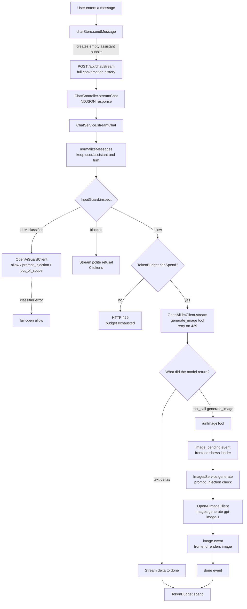
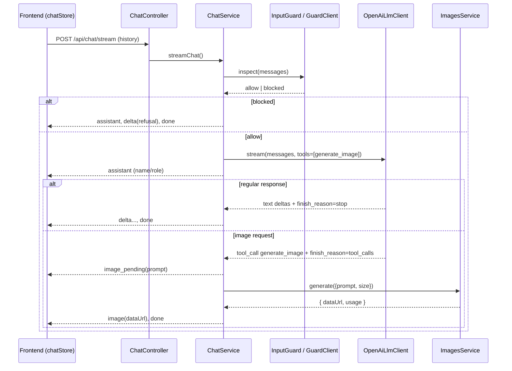

# ai-less

A monorepo with an AI chat app where one model can both answer with text and generate images. The model decides whether to respond with text or call the image tool; the client does not route the request itself.

- `apps/backend` - NestJS API for orchestration and OpenAI integrations
- `apps/frontend` - Vite + React + MobX UI with streamed responses

## Running

```bash
pnpm install
pnpm dev # run backend and frontend in parallel
# or run them separately:
pnpm dev:backend
pnpm dev:frontend
```

The backend listens on `http://localhost:3000`, and the frontend runs on `http://localhost:5173` with `/api` proxied to the backend.

### Environment Variables (`apps/backend/.env`)


| Variable                | Purpose                   | Default                 |
| ----------------------- | ------------------------- | ----------------------- |
| `OPENAI_API_KEY`        | OpenAI API key (required) | -                       |
| `OPENAI_MODEL`          | Chat/orchestrator model   | `gpt-5.4-mini`          |
| `OPENAI_GUARD_MODEL`    | Guard classifier model    | `OPENAI_MODEL`          |
| `OPENAI_IMAGE_MODEL`    | Image generation model    | `gpt-image-1`           |
| `TOKEN_BUDGET_PER_HOUR` | Hourly token budget       | `20000`                 |
| `FRONTEND_ORIGIN`       | Frontend CORS origin      | `http://localhost:5173` |
| `PORT`                  | Backend port              | `3000`                  |


## API

- `POST /api/chat` - non-streaming text response.
- `POST /api/chat/stream` - primary endpoint. Returns an NDJSON event stream, one event per line. Both text responses and image generation flow through this endpoint.

## Flow

All user input goes through a single endpoint: `/api/chat/stream`. On the backend, the request passes through this pipeline: safety check -> budget check -> model with tools -> branch into text response or image generation.




### Stream Event Sequence




### Stream Event Types (NDJSON)


| `type`          | When                                   | Fields                                             |
| --------------- | -------------------------------------- | -------------------------------------------------- |
| `assistant`     | At the start of the response           | `assistant: { name, roleDescription }`             |
| `delta`         | Text chunk                             | `delta: string`                                    |
| `image_pending` | The model decided to generate an image | `prompt: string`                                   |
| `image`         | Image is ready                         | `prompt`, `image: { dataUrl, mimeType }`, `usage?` |
| `done`          | End of response                        | `message`, `usage`, `budget`                       |
| `error`         | Stream error                           | `message: string`                                  |


## Logic and Protection Layers

1. **Single entry point.** The frontend does not decide whether the request is text or image-related. It always sends the full conversation to `/api/chat/stream`. The model routes through the `generate_image` tool (`chat-tools.ts`), so natural phrasing and conversational context work, including follow-ups like "make it brighter" after a previous image.
2. **InputGuard (safety).** Before the model call, a cheaper LLM classifier (`OpenAiGuardClient`) labels input as `prompt_injection`, `out_of_scope`, or `allow`. Image generation requests are treated as `allow` because they are a supported capability. If the classifier fails, the system is **fail-open** and relies on the system prompt instead, so the chat does not break.
3. **System prompt as the main role guard.** The assistant persona and constraints live in `assistant-profile.ts`; the model is expected to keep the role and refuse disallowed requests.
4. **TokenBudget.** An hourly sliding-window token limit. When the budget is exceeded, the API returns `429`. Model usage is charged against the budget.
5. **Retries.** Model calls are retried on `429` with exponential backoff, up to 5 attempts.

## Key Files


| File                               | Role                                                                                  |
| ---------------------------------- | ------------------------------------------------------------------------------------- |
| `chat/chat.controller.ts`          | HTTP endpoints for `/api/chat` and `/api/chat/stream` (NDJSON)                        |
| `chat/chat.service.ts`             | Orchestrator: guard -> budget -> model -> text/image branch                           |
| `chat/chat-tools.ts`               | `generate_image` tool description and model guidance                                  |
| `chat/openai-llm.client.ts`        | OpenAI chat completions adapter and streamed tool-call assembly                       |
| `chat/input-guard.ts`              | `InputGuard`, a fail-open wrapper around the classifier                               |
| `chat/openai-guard.client.ts`      | Safety LLM classifier                                                                 |
| `chat/assistant-profile.ts`        | Assistant name, role description, and system prompt                                   |
| `chat/token-budget.ts`             | Hourly token budget                                                                   |
| `images/images.service.ts`         | Image generation plus prompt-injection check                                          |
| `images/openai-image.client.ts`    | OpenAI Images API adapter                                                             |
| `frontend/src/stores/chatStore.ts` | MobX store for sending requests, reading the NDJSON stream, and rendering text/images |


## Build

```bash
pnpm --filter @ai-less/backend build
pnpm --filter @ai-less/frontend build
```
