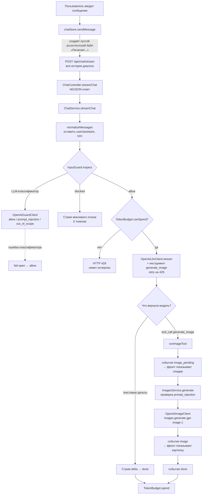
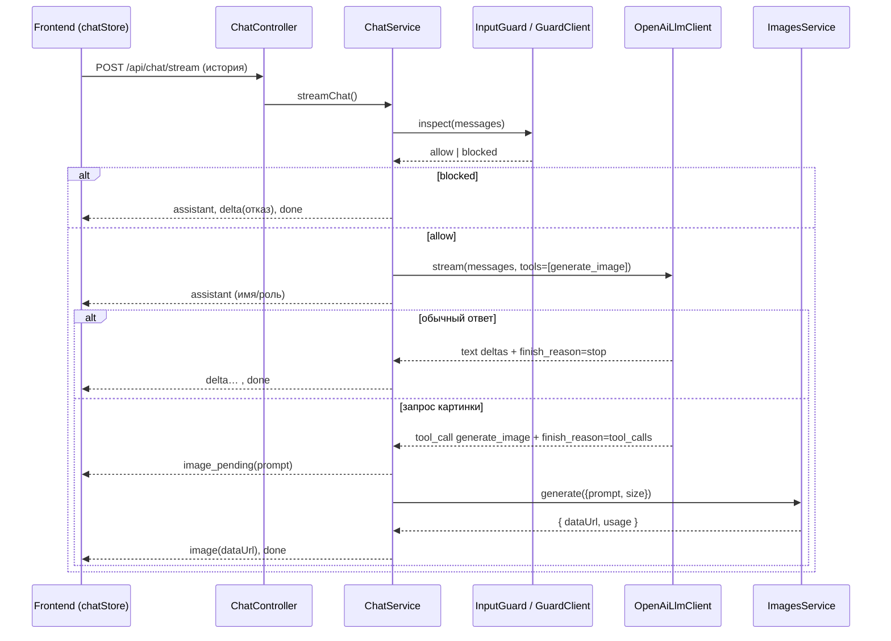

# ai-less

Монорепозиторий с AI-чатом, в котором одна модель отвечает текстом **и** генерирует изображения. Решение «текст или картинка» принимает сама модель через tool calling, а не клиент.

- `apps/backend` — NestJS API (оркестратор + OpenAI-интеграции)
- `apps/frontend` — Vite + React + MobX UI со стримингом ответа

## Запуск

```bash
pnpm install
pnpm dev            # backend + frontend параллельно
# или по отдельности:
pnpm dev:backend
pnpm dev:frontend
```

Backend слушает `http://localhost:3000`, frontend — `http://localhost:5173` (проксирует `/api` на backend).

### Переменные окружения (`apps/backend/.env`)

| Переменная | Назначение | По умолчанию |
| --- | --- | --- |
| `OPENAI_API_KEY` | Ключ OpenAI (обязателен) | — |
| `OPENAI_MODEL` | Модель для чата/оркестратора | `gpt-5.4-mini` |
| `OPENAI_GUARD_MODEL` | Модель для guard-классификатора | `OPENAI_MODEL` |
| `OPENAI_IMAGE_MODEL` | Модель генерации изображений | `gpt-image-1` |
| `TOKEN_BUDGET_PER_HOUR` | Часовой лимит токенов | `20000` |
| `FRONTEND_ORIGIN` | CORS-origin фронта | `http://localhost:5173` |
| `PORT` | Порт backend | `3000` |

## API

- `POST /api/chat` — нестриминговый ответ (текст).
- `POST /api/chat/stream` — основной эндпоинт. Возвращает поток NDJSON-событий (по событию на строку). Через него идёт и текст, и генерация изображений.

## Как работает сценарий

Весь пользовательский ввод идёт в **один** эндпоинт `/api/chat/stream`. На бэкенде запрос проходит конвейер: проверка безопасности → проверка бюджета → модель с инструментами → ветвление на текст или генерацию изображения.



### Последовательность стрим-событий



### Типы событий стрима (NDJSON)

| `type` | Когда | Поля |
| --- | --- | --- |
| `assistant` | В начале ответа | `assistant: { name, roleDescription }` |
| `delta` | Кусок текста | `delta: string` |
| `image_pending` | Модель решила сгенерировать картинку | `prompt: string` |
| `image` | Картинка готова | `prompt`, `image: { dataUrl, mimeType }`, `usage?` |
| `done` | Конец ответа | `message`, `usage`, `budget` |
| `error` | Ошибка стрима | `message: string` |

## Логика и слои защиты

1. **Единая точка входа.** Фронт не решает, текст это или картинка — он всегда шлёт в `/api/chat/stream`. Роутинг делает модель через инструмент `generate_image` (`chat-tools.ts`), поэтому работают естественные формулировки и контекст диалога («сделай её ярче» про прошлую картинку).
2. **InputGuard (безопасность).** Перед вызовом модели отдельный дешёвый LLM-классификатор (`OpenAiGuardClient`) размечает ввод: `prompt_injection` / `out_of_scope` / `allow`. Запрос на генерацию изображения считается `allow` (поддерживаемая возможность). При сбое классификатора — **fail-open** (пропускаем, полагаясь на system prompt), чтобы чат не падал.
3. **System prompt — основная защита роли.** Персона и ограничения заданы в `assistant-profile.ts`; модель сама держит роль и отказывается от запрещённого.
4. **TokenBudget.** Часовой лимит токенов со скользящим окном; при превышении — `429`. На бюджет списывается usage вызова модели.
5. **Ретраи.** Вызовы модели повторяются на `429` (экспоненциальный backoff, до 5 попыток).

## Карта ключевых файлов

| Файл | Роль |
| --- | --- |
| `chat/chat.controller.ts` | HTTP-эндпоинты `/api/chat` и `/api/chat/stream` (NDJSON) |
| `chat/chat.service.ts` | Оркестратор: guard → бюджет → модель → ветвление text/image |
| `chat/chat-tools.ts` | Описание инструмента `generate_image` + подсказка модели |
| `chat/openai-llm.client.ts` | Адаптер OpenAI chat completions + сборка tool-calls из стрима |
| `chat/input-guard.ts` | `InputGuard` (fail-open обёртка над классификатором) |
| `chat/openai-guard.client.ts` | LLM-классификатор безопасности |
| `chat/assistant-profile.ts` | Имя, описание роли и system prompt ассистента |
| `chat/token-budget.ts` | Часовой лимит токенов |
| `images/images.service.ts` | Генерация изображений (+ проверка prompt_injection) |
| `images/openai-image.client.ts` | Адаптер OpenAI Images API |
| `frontend/src/stores/chatStore.ts` | MobX-store: отправка, чтение NDJSON-стрима, рендер текста/картинок |

## Сборка

```bash
pnpm --filter @ai-less/backend build
pnpm --filter @ai-less/frontend build
```
