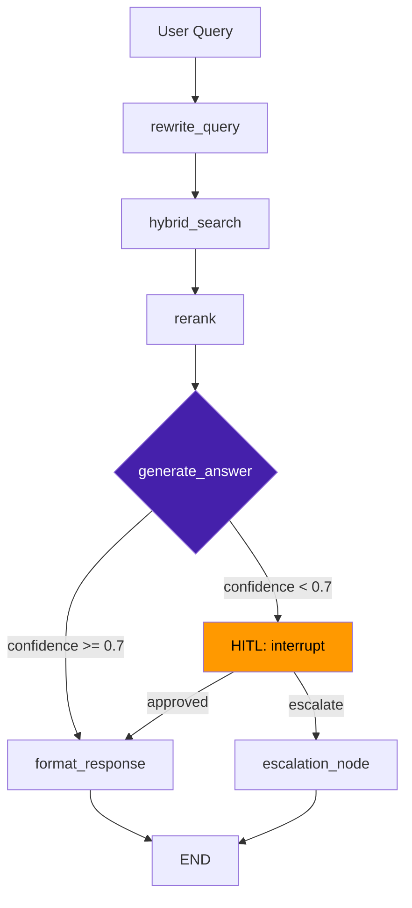

# День 11 (Неделя 3) • Практика: архитектурная сессия

Сегодня не пишем код — проектируем. Это подготовка к демонстрациям: завтра (четверг) и послезавтра (пятница) проходят демо-дни. Артефакты этой сессии — граф, State TypedDict, Mermaid-схема — должны быть готовы до того, как вы откроете редактор.

---

## Шаг 1: Выберите задачу (15 минут)

Выберите одну из предложенных предметных областей или предложите свою:

| Область | Синтетические данные | Пользователь агента |
|---|---|---|
| HR-ассистент | employees.json, org chart, политики | HR-менеджер |
| Юридический ассистент | договоры, регламенты, FAQs | Юрист / менеджер |
| IT Service Desk | incidents, runbooks, knowledge base | Инженер / поддержка |
| Sales-ассистент | продукты, прайс, CRM-история | Менеджер по продажам |
| Финансовый аналитик | отчёты, бюджеты, KPI | Финдиректор / аналитик |

**Заполните:**
```
Мой агент делает: _______________________________________________
Пользователь: _________________________________________________
Вход: _________________________________________________________
Выход: ________________________________________________________
```

---

## Шаг 2: Проектирование данных (15 минут)

**Создайте синтетические данные** — минимум 10–15 документов/записей, достаточно для демо:

```bash
# Структура данных в репозитории
data/
  raw/          # исходные документы (PDF, MD, JSON)
  processed/    # чанки после preprocessing
  
# Примеры синтетических данных
employees.json           # 20 сотрудников с ролями, департаментами
policies/leave.md        # политика отпусков
policies/remote.md       # удалённая работа
incidents/               # 10 инцидентов с resolution
```

**Ответьте на вопросы:**
```
Формат данных: ________________________________________________
Qdrant-коллекция: _____________________________________________
Chunking-стратегия: ___________________________________________
Embedding модель: _____________________________________________
Поля метаданных для фильтрации: ______________________________
```

---

## Шаг 3: Нарисуйте граф (20 минут)

**Правило:** нарисуйте на бумаге или в Excalidraw **до** написания кода.

Минимальный граф для финального проекта:

```
rewrite_query → hybrid_search → rerank → generate_answer → confidence_router
                                                                    ↓ low
                                                              HITL: interrupt
                                                                    ↓ approved
                                                             format_response → END
```

**Заполните таблицу узлов:**

| Узел | Что делает | Читает из state | Пишет в state |
|---|---|---|---|
| rewrite_query | | query | rewritten_query |
| hybrid_search | | rewritten_query | retrieved_chunks |
| ... | | | |

**Ответьте на вопросы:**
```
Количество узлов: _____________________________________________
Conditional edges: ____________________________________________
Где HITL: _____________________________________________________
Где fallback: _________________________________________________
```

---

## Шаг 4: Определите State (15 минут)

Напишите `TypedDict` до написания любого другого кода:

```python
from typing import TypedDict, Annotated
from langgraph.graph.message import add_messages

class AgentState(TypedDict):
    # Входные данные
    query: str
    session_id: str
    
    # Промежуточные результаты
    rewritten_query: str
    retrieved_chunks: list[dict]  # [{"text": ..., "source": ..., "score": ...}]
    
    # Выходные данные
    answer: str
    confidence: float
    sources: list[str]
    
    # Управление
    messages: Annotated[list, add_messages]
    revision_count: int
    hitl_required: bool
```

**Правило:** если поле не нужно в state — его нет. Не добавляйте поля "на будущее".

---

## Шаг 5: Заполните Mermaid-шаблон (15 минут)

Скопируйте и заполните своими узлами:



Отрендерите схему на `https://mermaid.live` — сохраните скриншот как `docs/agent-graph-design.png`.

---

## Шаг 6: Чеклист готовности к реализации

Перед тем как открыть редактор — ответьте на все вопросы:

**Данные:**
- [ ] Синтетические данные созданы (≥10 документов)
- [ ] Qdrant-коллекция спроектирована (имя, векторная размерность, метаданные)
- [ ] Chunking-стратегия выбрана и обоснована

**Архитектура:**
- [ ] Граф нарисован на бумаге / в Excalidraw
- [ ] State TypedDict написан (все поля с типами)
- [ ] Все узлы перечислены с описанием входа/выхода
- [ ] HITL-сценарий прописан (когда interrupt, что делает оператор)
- [ ] Fallback-сценарий прописан (что происходит при низкой уверенности)

**Надёжность:**
- [ ] Что произойдёт если LLM вернёт мусор? (validation)
- [ ] Что произойдёт если Qdrant вернёт 0 результатов?
- [ ] Что произойдёт при RateLimitError?

**Deliverables:**
- [ ] Mermaid-схема графа готова
- [ ] Структура репозитория спланирована
- [ ] `.env.example` с переменными набросан

---

## Шаг 7: Начало реализации (оставшееся время)

После заполнения чеклиста — напишите State и один stub-узел, чтобы убедиться что граф компилируется:

```python
from typing import TypedDict
from langgraph.graph import StateGraph, START, END

class AgentState(TypedDict):
    query: str
    answer: str

def stub_node(state: AgentState) -> dict:
    return {"answer": "hardcoded stub response"}

builder = StateGraph(AgentState)
builder.add_node("stub_node", stub_node)
builder.add_edge(START, "stub_node")
builder.add_edge("stub_node", END)
graph = builder.compile()

result = graph.invoke({"query": "тест"})
print(result)  # {"query": "тест", "answer": "hardcoded stub response"}
```

Граф должен компилироваться и запускаться. Остальные узлы реализуйте уже с реальной логикой.
