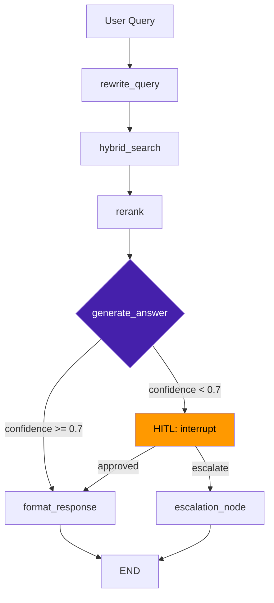

# День 11 (Неделя 3) • Финальный проект: архитектурная сессия

## 📋 Формат дня:

- 🏆 Критерии успешного агента (15 мин)
- 🗺️ Архитектурная сессия: проектируем вместе (60 мин)
- 🛠️ Начало реализации (60 мин)
- 🔍 Промежуточный чекин (15 мин)
- 📋 Финальные требования к сдаче (10 мин)

---

### 🏆 Что делает агента production-ready

Не «запустилось и отвечает», а:

| Критерий | Что проверяем |
|---|---|
| **Надёжность** | Обрабатывает ошибки, retry на 429, fallback на низкой уверенности |
| **Польза** | Решает конкретную задачу из синтетических данных заказчика |
| **Автономность** | Выполняет несколько шагов без оператора |
| **Объяснимость** | Mermaid-схема + LangSmith трейс показывают что происходит |
| **Воспроизводимость** | `docker-compose up` поднимает всё с нуля |

---

### 🗺️ Шаблон архитектуры финального проекта

Минимальный стек, покрывающий все требования ТЗ:

```
┌─────────────────────────────────────────────────────────────┐
│                      Финальный проект                        │
│                                                             │
│  User / Demo Interface                                      │
│        │                                                    │
│        ▼                                                    │
│  FastAPI  ──── POST /chat ────────────────────────────────► │
│        │                                                    │
│        ▼                                                    │
│  LangGraph Agent (StateGraph + checkpointer)                │
│        │                                                    │
│        ├──► [RAG Node]  ──► Qdrant (hybrid search)         │
│        ├──► [Tool Node] ──► MCP сервер (если есть)         │
│        ├──► [LLM Node]  ──► vLLM / OpenAI / GigaChat       │
│        └──► [HITL Node] ──► interrupt() при низкой уверен. │
│                                                             │
│  PostgreSQL (checkpoints) + LangSmith (traces)             │
└─────────────────────────────────────────────────────────────┘
```

---

### 🗺️ Архитектурная сессия: вопросы для проектирования

Каждый участник / пара отвечает на эти вопросы перед тем как писать код:

**1. Задача**
- Что именно делает ваш агент? (одно предложение)
- Кто пользователь? Что является входом и выходом?

**2. Данные**
- Какие синтетические данные используете?
- Как они индексируются? (Qdrant коллекция, JSON-файл, SQLite?)

**3. Граф**
- Сколько узлов? Нарисуйте на бумаге перед кодом.
- Есть ли ветвления? Что роутит?
- Где нужен HITL? (не везде, только для высокорисковых действий)

**4. Надёжность**
- Что произойдёт если LLM вернёт низкую уверенность?
- Что произойдёт если Qdrant не найдёт ничего?

**5. Deliverables**
- Какие Mermaid-схемы вы сдадите?
- Как будет выглядеть демо (2 минуты)?

---

### 📐 Mermaid-шаблон для финального проекта

Скопируйте и заполните перед началом реализации:



Используйте цвета для выделения критических точек:
- 🟡 HITL-узлы (оранжевый)
- 🟣 LLM-узлы (фиолетовый)
- 🔴 Ошибки/fallback (красный)

---

### 🛠️ С чего начать реализацию

**Порядок разработки (не нарушайте):**

1. **State first** — определите `TypedDict` с полями
2. **Nodes as stubs** — заглушки возвращают фиксированные данные
3. **Wire the graph** — проверьте что граф компилируется и вызывается
4. **Заполните узлы** один за другим, тестируйте каждый изолированно
5. **Добавьте checkpointer** — переключите с `InMemorySaver` на `SqliteSaver`
6. **Добавьте RAG** — подключите Qdrant
7. **HITL** — добавьте `interrupt()` и проверьте полный цикл
8. **Docker** — упакуйте всё в контейнер
9. **Mermaid** — сгенерируйте схему: `draw_mermaid()`

```python
# Шаг 2: stub-узел для быстрой проверки графа
def hybrid_search(state: AgentState) -> dict:
    # TODO: реальный поиск
    return {"retrieved_chunks": [{"text": "stub", "source": "test.md", "score": 0.9}]}
```

---

### 📋 Чеклист финального проекта

**Код:**
- [ ] Граф запускается через `docker-compose up`
- [ ] HITL: прерывание работает, resume работает
- [ ] Fallback при `confidence < threshold`
- [ ] `.env.example` с описанием всех переменных
- [ ] `README.md`: инструкция запуска за 5 минут

**Архитектурные схемы (`docs/`):**
- [ ] `agent-graph.md` — Mermaid из `draw_mermaid()`
- [ ] `infrastructure.md` — схема сервисов (API + Qdrant + Postgres)
- [ ] `state-transitions.md` — что хранится в state, как меняется

**Демо (четверг/пятница, 10 минут на команду):**
- [ ] Показать `docker-compose up` (или уже запущенное)
- [ ] Два live-запроса: с высокой уверенностью и с HITL
- [ ] LangSmith trace: показать токены и latency
- [ ] Mermaid-схема: объяснить 2–3 ключевых решения

---

### 🎯 Финал курса

**Что вы построили за 3 недели:**

- **Неделя 1:** Tooling (Cursor, LLM API, RAG, MCP) — фундамент
- **Неделя 2:** Agents (LangChain, LangGraph, HITL, fallback) — логика
- **Неделя 3:** Multi-agent, local LLM, финальный проект — доставка

**Навыки middle+ инженера с AI:**
- Проектировать системы с явным state management
- Балансировать между надёжностью и autonomy
- Делать прозрачными решения агента (observability)
- Упаковывать в production-ready артефакты

> Инженер-с-AI не тот, кто умеет написать промпт. А тот, кто умеет спроектировать надёжную систему вокруг LLM.
